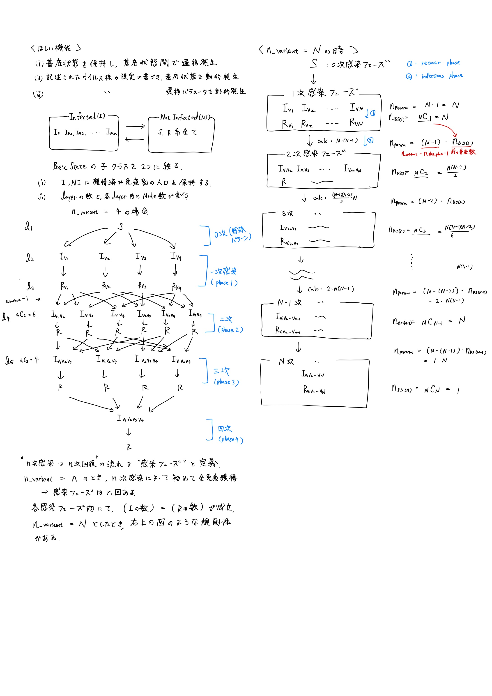

# Corona Model implemention memo

## 計算モデルの設計

### 1. ライフサイクル

モデルは差分方程式で記述する以上、for 文で各フェーズごとに計算を実行する。  
計算開始から終了までの一連の流れをライフサイクルと定義する。  
ライフサイクルで行う計算は以下の通り。

(1) 各ライフサイクルで定義されたイベントを実行
(2) 空間同士での各基底状態の人口移動  
(3) 各基底状態間での状態遷移の差分計算
(4) 各基底状態での死亡人数を含め、差分を反映  
(5) フェーズ終了処理

以下、各フェーズの詳細設計を記述する。

### 2. ライフサイクルイベント

特定の時間以降に発生する状況や、各フェーズの計算前に必要な処理を記述する。  
現状定義されている処理は以下の通り。

- 空間同士の人の移動
- 時間を進める
- 変異株の発生

今後定義する可能性のあるものは以下の通り

- 社会的要因による感染力の動的変更

ただし、社会的要因の実装には、直近の感染記録を解析・理解する仕組みが必要である。  
空間移動の影響により、グラフ上の人数が一定の割合で振動してしまうため、この解析部分の実装コストが高い。  
したがって、実装は余裕があれば行うものとし、現段階では実装しない。

### 3. 空間同士での各基底状態の人口遷移

任意の数の空間を定義し、その空間内で感染が発生するものとする。  
感染を計算する前段階にて、空間同士での人々の移動を実行する。  
これはライフサイクルイベントに属すものとして設計する。

### 4. 空間内での各基底状態間での人口遷移

計算時に必要な要素

- ライフサイクルイベントを実行し、人間の状態に反映する
- すべての基底状態を保持する

記述されたウイルス株の設定に基づき、

- 必要な基底状態を動的に発生する
- 必要な遷移パラメータを動的に発生する
- 生成された遷移パラメータと基底状態について、計算を実行する

これをもとに、必要なクラスを設計した。以下の通り。

#### a. 基底状態の定義

S,R の間で保持する情報は、免疫を保持しているかどうかという点にしか差異がない  
後に記述するレイヤー&ノード自動作成による計算実行フェーズの設計の都合上、なるべくシンプルにする必要がある  
したがって、S,R を NI に統合し、I(,E)を I に統合する  
BasicPeopleState >>(extends)>> Infectious,NotInfectious

- BasicPeopleState（親クラス）

  - 保持する情報：人口、差分、獲得免疫タイプ、死亡率

- Infectious（子クラス）

  - 新たに保持する情報：変異株情報

- NotInfected（子クラス）
  - 新たに保持する情報：なし

#### b. レイヤー構造とノード生成機構

- 詳しい図は、ノート(上図)を参照のこと。
- 感染の様子は、感染フェーズに分解される。
- 各感染フェーズは、その前後のフェーズへの感染段階と、フェーズ内の感染 -> 回復状態への遷移からなる。
- これを遷移図として表すと、各階層毎にレイヤー構造を伴う、nodeTree が出来上がる。感染に関する計算は、この nodeTree を参照して実行するものとする。
- レイヤー&ノード生成機構は、ウイルスの変異株の種類（Array）を読み込んだうえで、各感染フェーズに固有の組み合わせを組み合わせアルゴリズムによって生成する機構である。
- People クラスに実装する。

#### d.
